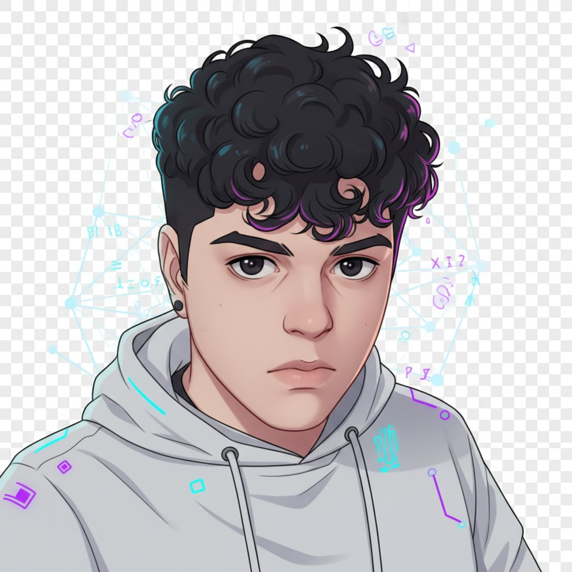

# README.md

````md
<div align="center">


<br/>



# felipe virginio


</div>

---

<div align="center">

### fullstack • ai • cloud • automation

software engineer focused on building modern fullstack applications, scalable backend systems, ai-powered automations and cloud-ready products.

i like turning ideas into clean interfaces, reliable apis and automated workflows using modern tools, ai-assisted development and practical engineering.

</div>

---

## currently building

```txt
> fullstack applications
> ai-powered automation systems
> scalable apis
> cloud-native workflows
> developer tools with ai assistance
````

---

## tech stack

### frontend

<p>
  
</p>

### backend

<p>
  
</p>

### cloud, devops & tools

<p>
  
</p>

### databases

<p>
  
</p>

---

## ai-assisted development

```txt
claude code   •   openai gpt   •   ollama   •   ai agents
prompt engineering   •   automation workflows   •   local ai experiments
```

i use ai tools as part of my development workflow to accelerate research, architecture decisions, debugging and implementation — always focusing on understanding, improving and shipping better systems.

---

## featured projects

### closezap ai


<br/>


<br/>

ai-powered lead management and automation dashboard built to simulate real sales workflows, track lead intent and support automated follow-ups.

**stack:** fastapi • react • sqlite • ai automation • api workflows

[live demo](https://closezap-ai.vercel.app/) • [github](https://github.com/fezleep)

---

### portfolio


<br/>

personal developer portfolio with a dark, minimal and cyber-inspired interface focused on presenting projects, skills and professional identity.

**stack:** react • next.js • javascript • css • vercel

[live demo](https://portfolio-dev-alpha-eight.vercel.app/)

---

## developer environment

```txt
editor: vscode
os: windows
workflow: git + github + docker + ai-assisted development
focus: fullstack systems, automation, cloud and product-oriented engineering
```

---

<div align="center">


</div>

---

## github stats

<div align="center">


</div>

---

## open to opportunities

i'm open to software engineering opportunities involving:

```txt
fullstack development
frontend applications
backend systems
api integrations
ai automation
cloud and devops workflows
```

---

## connect

<div align="center">

[](https://portfolio-dev-alpha-eight.vercel.app/)
[](https://linkedin.com/in/fezleep)
[](https://github.com/fezleep)
[](mailto:virginio.9001@gmail.com)

</div>

---

<div align="center">


<br/>

```txt
building quietly. shipping constantly.
```

</div>
```
