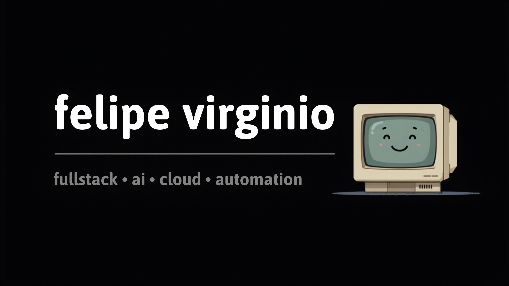
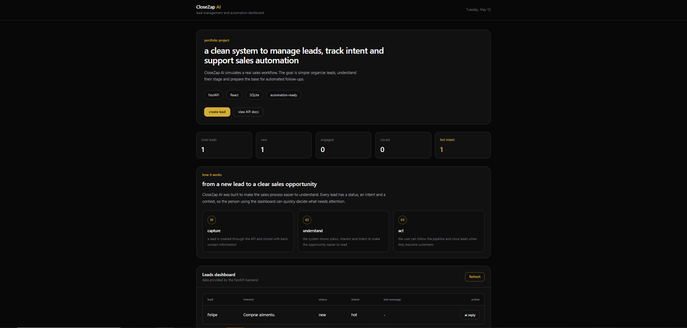
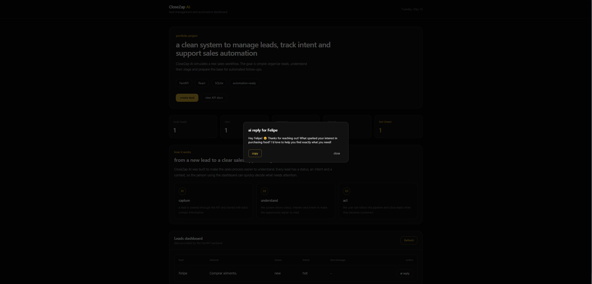
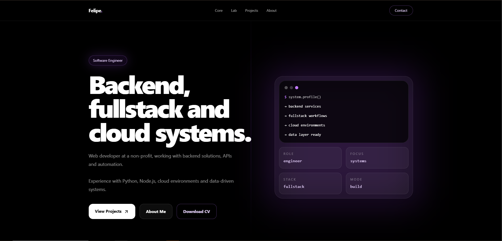

  

 

  
  
  

---

## fullstack • ai • cloud • automation

software engineer focused on building modern fullstack applications, scalable backend systems, ai-powered automations and cloud-ready products.

i like turning ideas into clean interfaces, reliable apis and automated workflows using modern tools, ai-assisted development and practical engineering.

---

## current focus

<table>
  <tr>
    <td width="50%">
      <b>fullstack applications</b> 
      modern web apps with clean interfaces, reusable components and scalable backend integrations.
    </td>
    <td width="50%">
      <b>ai automation systems</b> 
      workflows powered by ai, apis and intelligent automations to reduce manual effort.
    </td>
  </tr>
  <tr>
    <td width="50%">
      <b>cloud-ready products</b> 
      applications designed for deployment, maintainability and practical production usage.
    </td>
    <td width="50%">
      <b>developer tooling</b> 
      ai-assisted workflows using claude code, openai, ollama, docker and github.
    </td>
  </tr>
</table>

---

## stack

### frontend

### backend

### cloud, devops & tools

### databases

---

## ai-assisted development

<table>
  <tr>
    <td>
      <b>tools</b> 
      claude code • openai gpt • ollama • ai agents
    </td>
    <td>
      <b>workflow</b> 
      research • architecture • debugging • implementation • automation
    </td>
  </tr>
</table>

i use ai tools as part of my development workflow to accelerate research, architecture decisions, debugging and implementation — always focusing on understanding, improving and shipping better systems.

---

## featured projects

<table>
  <tr>
    <td width="50%">
      <h3>closezap ai</h3>
      
ai-powered lead management and automation dashboard built to simulate real sales workflows, track lead intent and support automated follow-ups.

      
<b>stack:</b> fastapi • react • sqlite • ai automation • api workflows

      

        <a href="https://closezap-ai.vercel.app/">live demo</a>
        ·
        <a href="https://github.com/fezleep/closezap-ai">github</a>
      

    </td>
    <td width="50%">
      
    </td>
  </tr>
</table>

 

  

---

<table>
  <tr>
    <td width="50%">
      
    </td>
    <td width="50%">
      <h3>portfolio</h3>
      
personal developer portfolio with a dark, minimal and cyber-inspired interface focused on presenting projects, skills and professional identity.

      
<b>stack:</b> react • next.js • javascript • css • vercel

      

        <a href="https://portfolio-dev-alpha-eight.vercel.app/">live demo</a>
      

    </td>
  </tr>
</table>

---

## developer environment

<table>
  <tr>
    <td><b>editor</b></td>
    <td>vscode</td>
  </tr>
  <tr>
    <td><b>os</b></td>
    <td>windows</td>
  </tr>
  <tr>
    <td><b>workflow</b></td>
    <td>git • github • docker • ai-assisted development</td>
  </tr>
  <tr>
    <td><b>focus</b></td>
    <td>fullstack systems • automation • cloud • product-oriented engineering</td>
  </tr>
</table>

---

## github stats

---

## open to opportunities

---

## connect

---

 

building quietly. shipping constantly.

